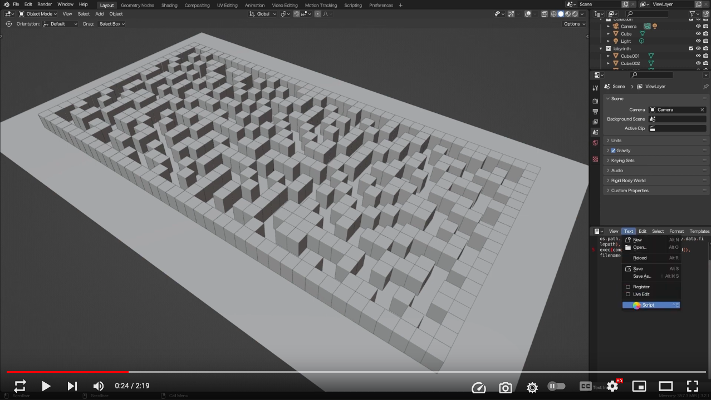

# Labyrinth Generator

## 1. About

Implementation of the maze generation algorithm [*穴掘り法*](http://www5d.biglobe.ne.jp/~stssk/maze/make.html) in Rust.

You can import the output CSV in Blender to render it. See [`./samples/sample.py`](./samples/sample.py) for the detail.

| [](https://www.youtube.com/watch?v=g_6iUbawciA) |
| :-: |
| Demo (YouTube) |

## 2. Usage

```bash
$ cargo run <height> <width>
```

<!-- vim: set spell: -->

